# AI Documentation Generator

Generates structured markdown documentation from a local Python repository using an LLM. Scans `.py` files, extracts APIs via AST, and produces a README with overview, table of contents, and API reference.

---

## Architecture

The following diagram shows the high-level flow and components:



| Layer | Components |
|-------|------------|
| **API** | FastAPI app → `POST /generate-docs` |
| **Orchestration** | `doc_generator`: read → parse → LLM → markdown → write |
| **Core** | `repo_reader`, `code_parser`, `markdown_builder`, `file_writer` |
| **LLM** | LangChain + Azure OpenAI / OpenAI / Ollama |

---

## Quick Start

**1. Activate env and install**

```bash
source /path/to/Anuj-AI-ML-Lab/.venv/bin/activate
cd MCP_tools/DocGenAgent
pip install -r requirements.txt
```

**2. Start the API**

```bash
./run.sh
# or: PYTHONPATH=. uvicorn api.main:app --reload --host 0.0.0.0 --port 8000
```

**3. Generate docs** (use a **local directory path**)

```bash
curl -X POST http://localhost:8000/generate-docs \
  -H "Content-Type: application/json" \
  -d '{"repo_path": "/absolute/path/to/your/repo"}'
```

Output is written to `outputs/generated_docs/README.md` inside this project.

---

## Configuration

Uses the **repository root** `.env` (e.g. `Anuj-AI-ML-Lab/.env`).

| Variable | Purpose |
|----------|---------|
| `AZURE_ENDPOINT` / `AZURE_KEY` / `API_VERSION` | Azure OpenAI (default) |
| `DOCGEN_LLM_PROVIDER` | `azure` \| `openai` \| `ollama` |
| `OPENAI_API_KEY` | When provider is `openai` |
| `OLLAMA_BASE_URL` / `OLLAMA_MODEL` | When provider is `ollama` |

---

## API

| Endpoint | Description |
|----------|-------------|
| `GET /` | Service info and link to `/docs` |
| `GET /health` | Health check |
| `GET /docs` | Swagger UI |
| `POST /generate-docs` | Generate README for a repo |

**Request body**

```json
{ "repo_path": "/local/path/to/repo" }
```

**Response**

- Success: `{ "status": "success", "readme_path": "..." }`
- Error: `{ "status": "error", "message": "..." }`

`repo_path` must be a **local directory**; GitHub URLs are not supported (clone the repo first and pass the local path).

---

## Project Layout

| Path | Role |
|------|------|
| `api/main.py` | FastAPI app and `/generate-docs` handler |
| `core/repo_reader.py` | Traverse repo, return `.py` files and contents |
| `core/code_parser.py` | AST → classes, functions, params, docstrings |
| `core/doc_generator.py` | Orchestrates read → parse → LLM → markdown → write |
| `core/markdown_builder.py` | Overview, TOC, Installation, Usage, API Reference |
| `core/file_writer.py` | Writes to `outputs/generated_docs/` |
| `llm/chains.py` | LangChain + Azure OpenAI / OpenAI / Ollama |
| `llm/prompts.py` | Doc-generation prompts |
| `utils/config.py` | Env and paths |
| `utils/logger.py` | Structured logging |
| `docs/` | Architecture diagram and other assets |

---

## Logging

Events logged: `repo_scanned`, `files_processed`, `llm_call`, `documentation_generated`. Level set via `LOG_LEVEL` in `.env` (default `INFO`).
