# Knowledge Base Agent (RAG)

Answers **natural-language questions** using **your internal documents** (policies, wikis, runbooks). Built for **SaaS support**, **internal wikis**, and **ops docs**.

## Problem

Teams store truth in scattered files; support and engineers waste time searching. This service **indexes** a folder of docs and **retrieves + summarizes** grounded answers via RAG.

## How it works

1. **Ingest** — `POST /ingest` reads `.md`, `.txt`, `.pdf` from a directory, chunks text, stores **embeddings** in **Chroma** (persistent under `data/chroma_db/`).
2. **Query** — `POST /query` embeds the question, retrieves top-k chunks, and calls your **LLM** (default **Azure OpenAI** from repo `.env`) with strict “answer from context only” instructions.
3. **Response** — Returns `answer` plus `sources` (file paths + short snippets).

## Architecture

<p align="center">
  
</p>

## Quick start

```bash
source /path/to/Anuj-AI-ML-Lab/.venv/bin/activate
cd MCP_tools/KnowledgeBaseAgent_MCP
pip install -r requirements.txt
./run.sh
```

### Embeddings (choose one)

| Mode | When to use |
|------|----------------|
| **Azure** (default) | `KB_EMBEDDING_PROVIDER=azure` — needs an **embedding deployment** in Azure; set `AZURE_EMBEDDING_DEPLOYMENT` (e.g. `text-embedding-ada-002`). |
| **HuggingFace** (local) | `KB_EMBEDDING_PROVIDER=huggingface` — no Azure embedding deployment; uses `sentence-transformers` (first run downloads the model). |
| **Ollama** | `KB_EMBEDDING_PROVIDER=ollama` — run Ollama with an embed model (e.g. `nomic-embed-text`). |

Chat LLM still uses `KB_LLM_PROVIDER` / `DOCGEN_LLM_PROVIDER`: `azure` | `openai` | `ollama` (same pattern as other agents).

### Index sample docs and ask

```bash
curl -s -X POST http://localhost:8020/ingest -H "Content-Type: application/json" -d '{"reset": true}'
curl -s -X POST http://localhost:8020/query -H "Content-Type: application/json" \
  -d '{"question": "What is the refund policy?"}'
```

Swagger: **http://localhost:8020/docs**

## API

| Endpoint | Purpose |
|----------|---------|
| `POST /ingest` | Body: `{ "docs_path": optional, "reset": false }` — index `kb_documents/` by default. |
| `POST /query` | Body: `{ "question": "..." }` |
| `GET /health` | Status + approximate indexed chunk count |

## Env (repo root `.env`)

- `AZURE_ENDPOINT`, `AZURE_KEY`, `API_VERSION` — chat + (if `KB_EMBEDDING_PROVIDER=azure`) embeddings base URL/key.
- `AZURE_EMBEDDING_DEPLOYMENT` — embedding model deployment name.
- `KB_EMBEDDING_PROVIDER` — `azure` \| `huggingface` \| `ollama`
- `KB_DOCS_DIR` — override default document folder.
- `KB_CHROMA_DIR` — override Chroma persist path.

## Layout

| Path | Role |
|------|------|
| `api/main.py` | FastAPI |
| `core/document_loader.py` | Load & chunk files |
| `core/vector_store.py` | Embeddings + Chroma |
| `core/rag_chain.py` | Retriever + LLM |
| `kb_documents/` | Drop internal docs here |
| `data/chroma_db/` | Vector index (gitignored) |
| `rag_system_structure.svg` | Architecture diagram (referenced above) |
